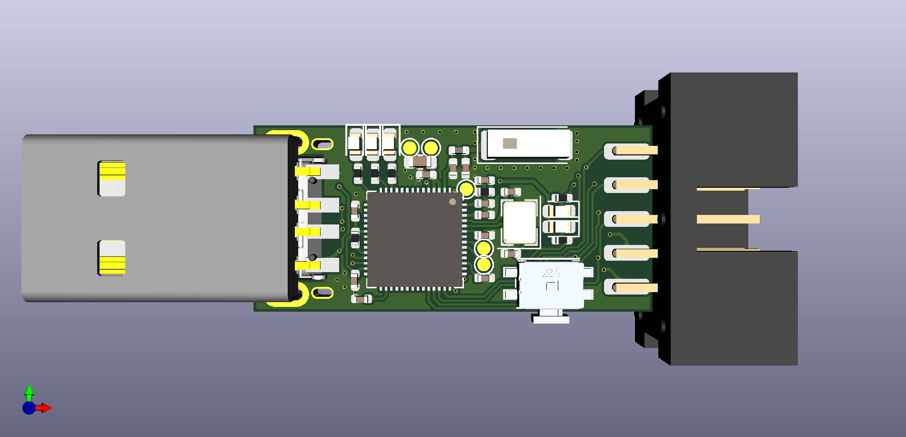

# ESP32S2-USB-UART

USB to UART board by ESP32-S2

## Feature

- [ ] USB to UART
- [ ] Flow control
- [ ] Auto download for ESP series chips
- [ ] Wireless auto download
- [ ] Four LEDs to indicate UART signal
- [ ] Optional 5V / 3.3V output

## Preview image

